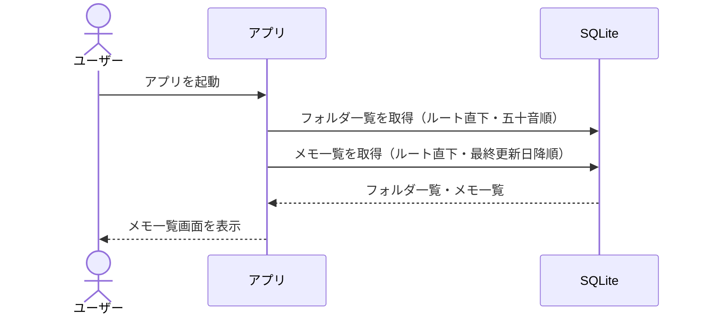
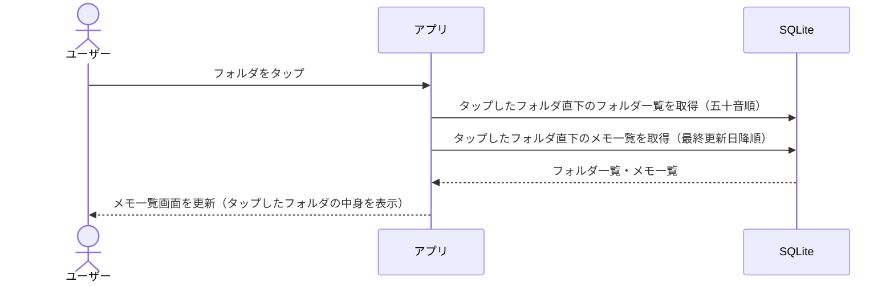
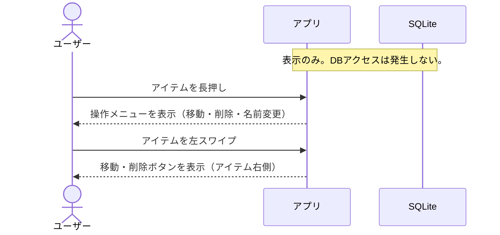
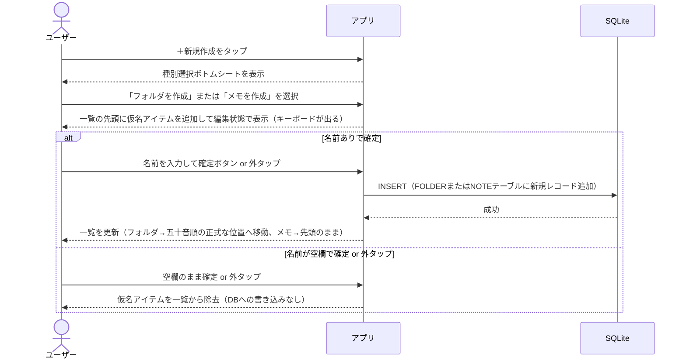
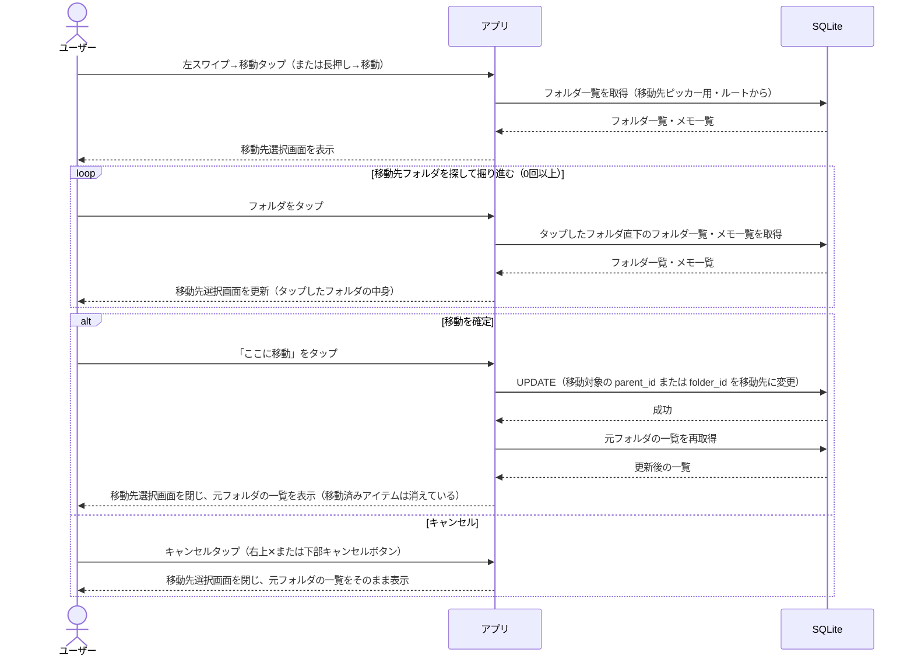

# シーケンス図（第1サイクル：メモ一覧・新規作成・移動先選択）

基本設計フェーズ・第1サイクルの3画面を対象とした、処理の流れを示す図。

**登場人物**
- **ユーザー**：アプリを操作する人
- **アプリ**：React Native フロントエンド（画面表示・ユーザー操作の受付）
- **SQLite**：端末内のローカルデータベース

**設計方針メモ**
- 操作メニュー（長押し・スワイプボタン）の表示はフロントエンドのみで完結。DBアクセス不要
- DBを触るのは「実際にアクションを実行するとき」のみ（作成・移動・削除など）
- 具体的なSQL文・エラーハンドリング・ローディング状態の制御は詳細設計で扱う

---

## フロー1: メモ一覧の初期表示

---

## フロー2: フォルダタップ（階層を深く入る）

---

## フロー3: 操作メニュー・スワイプボタンの表示（DBアクセスなし）

長押しメニュー・左スワイプボタンはフロントエンドに定義されたUIで、どのアイテムも同じ選択肢を持つ。表示時にDBを触る必要はない。

---

## フロー4: 新規アイテム作成

---

## フロー5: アイテムの移動

