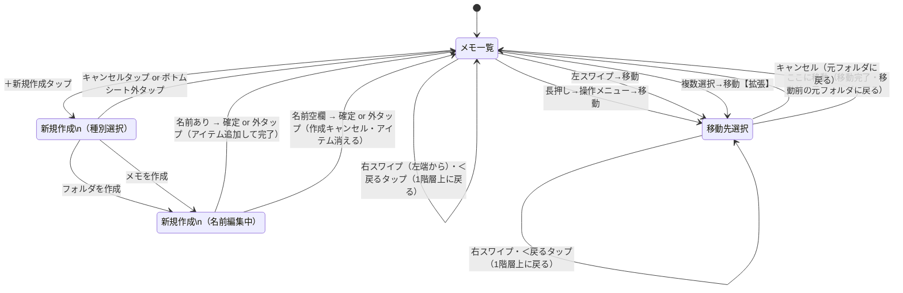

# 状態遷移図（第1サイクル：メモ一覧・新規作成・移動先選択）

基本設計フェーズ・第1サイクルの3画面を対象とした、ユーザー視点の状態遷移図。

- 対象画面：メモ一覧 / 新規作成（種別選択 + 名前編集）/ 移動先選択
- 【拡張】と付いているものは拡張フェーズで実装（v1では存在しない）

## 状態遷移図

## 状態の説明

| 状態 | 説明 |
|---|---|
| メモ一覧 | 現在開いているフォルダの中身を表示。フォルダタップで深く入り、右スワイプで上に戻る。どの階層にいるかで見え方は変わるが、状態としては同じ |
| 新規作成（種別選択） | 「フォルダを作成」「メモを作成」「キャンセル」のボトムシートが表示中 |
| 新規作成（名前編集中） | メモ一覧の上で新しいアイテムが選択状態で表示されキーボードが出ている。見た目はメモ一覧だが、操作できる内容が異なるため別状態として扱う |
| 移動先選択 | 移動先フォルダを選ぶピッカー画面。メモ一覧と似た構造だが、別の画面として手前に重なって表示される |

## ユーザーが誤解しやすいポイント

- **「名前編集中」はメモ一覧と同じ画面に見えるが、別状態**：キーボードが出ており、確定/キャンセルの挙動（空欄でアイテム消去）が通常の一覧と異なるため
- **移動先選択内の「戻る」は移動をキャンセルしない**：ピッカー画面の中で1階層浅くなるだけ。移動操作自体を中止するには「キャンセル」が必要
- **移動完了後は移動先ではなく元のフォルダに戻る**：移動したアイテムは見えなくなっている（移動先に移ったため）
