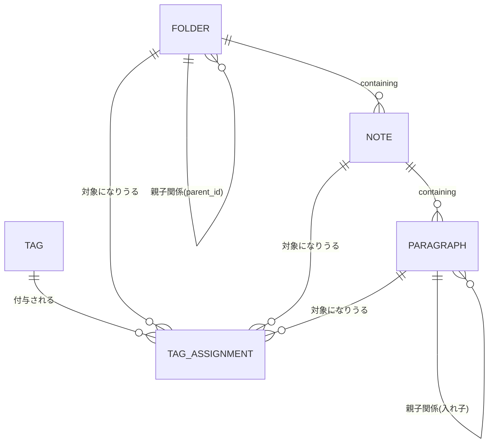

# ER図（論理レベル）

要件定義書（requirements.md）の3章（データモデル）の内容を図にしたもの。カラム名・データ型などの詳細は基本設計のテーブル定義書で決める。



`TAG_ASSIGNMENT`が、フォルダ・メモ・段落のどれにでもタグを付けられる「汎用的な中間テーブル」（`target_type`の仕組み）にあたる。

---

## Mermaid記法の読み方ガイド（ER図・鳥の足記法）

### ①宣言

```
erDiagram
```

「これからER図（実体と関係性の図）を描きます」という宣言。

⚠️ 補足：Mermaidには「全部の図に共通する1つの大元の文法」があるわけではなく、`graph`（フローチャート）と`erDiagram`はそれぞれ独立した別の文法。共通しているのは「最初の行で、これから何の図を描くかを宣言する」という外側の決まりだけで、箱・矢印・記号の意味などの中身はゼロから別々に設計されている。

### ②登場人物（実体）の名前

```
FOLDER ||--o{ NOTE : "containing"
```

`FOLDER`・`NOTE`がそれぞれ実体（テーブルに相当するもの）の名前。慣習として大文字で書く。

### ③関係性の記号（鳥の足記法）

ここが最も分かりにくい部分なので、図に書かれている記号の**形そのものに意味がある**ことを意識すると読みやすくなる。

```
FOLDER ||--o{ NOTE
       ↑左側    ↑右側
```

| 記号 | 見た目 | 意味 | なぜその形か |
|---|---|---|---|
| `\|\|` | まっすぐな2本線 | ちょうど1つ | 線が枝分かれしていない＝1つだけ、というイメージ |
| `o\|` | 丸＋線 | 0または1つ | 丸＝「ないかもしれない」を表す |
| `o{` | 丸＋三方向に開く線 | 0個以上（複数もありうる） | 三方向に開く線が、**カラスの足（鳥の足）**の形に見えることから「鳥の足記法（Crow's Foot記法）」と呼ばれる。足が枝分かれするように、「複数のものに分かれてつながる」ことを表している |

つまり`FOLDER ||--o{ NOTE`は、「FOLDER側はちょうど1つ、NOTE側は0個以上（複数もあり）」という関係を意味する。日本語にすると「1つのフォルダには、メモが0個以上ある」という関係になる。

### ④関係性の名前

```
: "containing"
```

コロンの後ろの文字列は、その関係に付けた名前（ラベル）。「FOLDERがNOTEをcontaining（含んでいる）」という関係であることを示している。

### この図の読み方まとめ

```
実体名 [関係の記号] 実体名 : "関係の名前"
```

この1パターンの繰り返しだけで、全体の関係図ができている。

### ⑤実際のコード、1行ずつの詳しい確認

#### 使われている英単語の意味

| 英単語 | 意味 |
|---|---|
| `FOLDER` | フォルダ |
| `NOTE` | メモ（英語で「記録・書き留めたもの」の意味。要件定義書の「メモ」と同じもの） |
| `PARAGRAPH` | 段落 |
| `TAG` | タグ |
| `TAG_ASSIGNMENT` | タグの割り当て。`TAG`（タグ）＋`ASSIGNMENT`（割り当て・付与）で、「どのタグを、どの対象に付けたか」を記録する役割の実体 |

#### 1行ごとの意味

```
FOLDER ||--o{ FOLDER : "親子関係(parent_id)"
```
左側の`FOLDER`を**親**、右側の`FOLDER`を**子**とみなす。「1つの親フォルダに対して、0個以上の子フォルダがある」という、フォルダ同士の親子関係（自分自身と同じ種類のものを参照しているので「自己参照」と呼ぶ）。

```
FOLDER ||--o{ NOTE : "containing"
```
「1つのフォルダに対して、0個以上のメモが含まれる（containing＝含んでいる）」という関係。

```
NOTE ||--o{ PARAGRAPH : "containing"
```
「1つのメモに対して、0個以上の段落が含まれる」という関係。

```
PARAGRAPH ||--o{ PARAGRAPH : "親子関係(入れ子)"
```
段落同士の自己参照。「1つの段落（親段落）に対して、0個以上の段落（中の小さい段落）がある」という入れ子構造。

```
TAG ||--o{ TAG_ASSIGNMENT : "付与される"
FOLDER ||--o{ TAG_ASSIGNMENT : "対象になりうる"
NOTE ||--o{ TAG_ASSIGNMENT : "対象になりうる"
PARAGRAPH ||--o{ TAG_ASSIGNMENT : "対象になりうる"
```
この4行はすべて`TAG_ASSIGNMENT`（タグの割り当て記録）に関する関係。「1つのタグは、0個以上の割り当て記録に使われる」「1つのフォルダ／メモ／段落は、それぞれ0個以上の割り当て記録の対象になりうる」という意味。この4つの関係をまとめることで、「タグはフォルダにもメモにも段落にも付けられる」という汎用的な仕組みが表現されている。

#### 補足：同じ実体が何度も登場する理由

`FOLDER`や`NOTE`が複数の行に登場しているのはコピーミスではない。**1つの実体は、複数の異なる関係に同時に参加できる**ため、関係ごとに1行ずつ書く必要がある（`FOLDER`は「フォルダ同士の親子関係」にも「メモを含む関係」にも「タグの対象になる関係」にも、それぞれ別の行で参加している）。

---

## 補足（Mermaid記法を知らない人向けの同じ図）

```
フォルダ ──（親子関係。1つの親に複数の子）── フォルダ自身
  │
  └── メモ（1つのフォルダに複数のメモ）
        │
        └── 段落（1つのメモに複数の段落）
              │
              └── 段落自身（入れ子。1つの段落に複数のミニ段落）

タグ ──（タグ付け。1つのタグを複数の対象に付けられる）── フォルダ・メモ・段落のどれか
```

矢印や線でつながれているもの同士が「親子関係」「含む・含まれる」の関係にある、という意味。「1つの親に対して、子は複数あってもよい」という前提で全部の関係が成り立っている。
