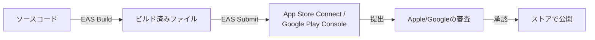

# システム構成図

要件定義書（requirements.md）の8章（技術選定）の内容を図にしたもの。

```mermaid
graph TD
    subgraph アプリ本体（無料機能はこれだけで完結）
        A["React Nativeアプリ<br/>(Hermes実行エンジン)"]
        B[("SQLite<br/>ローカルDB")]
        A -->|直接読み書き| B
    end

    subgraph 有料機能のみ（ここから先は別システム）
        C["認証サービス"]
        D[("クラウドストレージ<br/>自動バックアップ")]
        C --> D
    end

    A -.->|有料:自動バックアップ時のみ| C
```

実線が「無料の基本機能で常に発生するやり取り」、点線が「有料機能のときだけ発生するやり取り」。

⚠️ 無料機能の範囲では、ネットワークを挟んで通信する独立したシステムは存在せず、**「アプリ本体」1つだけ**で完結する（SQLiteはその内部の一部品）。有料機能（クラウドへの自動バックアップ）を使う場合のみ、本当の意味で複数システムが連携する構成になる。

なお、ビルド・ストア提出・審査などの「開発・公開の工程」は、この図が表す**実行時の構成とは別次元の話**（CI/CDパイプライン・リリースフローと呼ばれる別の図の領域）のため、ここからは除外した。その内容は[[スマホアプリの開発・テスト・公開の流れ（React Native・Expo）]]、または`docs/requirements/requirements.md`に記載している。

---

## Mermaid記法の読み方ガイド（フローチャート）

プログラミングの知識がなくても読めるように、1行ずつ分解して説明する。

### ①全体の向きを決める行

```
graph TD
```

- `graph` ＝「これから図を描きます」という宣言
- `TD` ＝ Top to Down（上から下へ）の略。図の向きを指定している。`LR`（Left to Right、左から右）にすることもできる

### ②グループにまとめる書き方

```
subgraph スマホ本体
    （ここに箱を並べる）
end
```

- `subgraph 名前` から `end` までの範囲が、1つの枠で囲われる
- 「スマホ本体」「有料機能のみ」「開発・公開」という3つの大きな枠が、この書き方で作られている

⚠️ 補足：矢印をどこに書くかは、見た目（描かれる図）には影響しない。どこに書いても同じ図になる。ただし人間が読みやすいように、**同じ枠の中だけでつながる矢印はその枠の中に、枠をまたぐ矢印は枠の外に書く**、という慣習がある（本ファイルもこの慣習に沿って書き直した）。

### ③箱（登場人物）の書き方

```
A["React Nativeアプリ<br/>(Hermes実行エンジン)"]
B[("SQLite<br/>ローカルDB")]
```

| 部分 | 意味 |
|---|---|
| `A`、`B` | その箱の「名前（ID）」。後で矢印を引くときに、この短い名前で呼び出す。画面には表示されない |
| `["文字"]` | 四角い箱の中に、その文字を表示する |
| `[("文字")]` | 角が丸い・円柱っぽい形の箱。今回は「データベースらしい見た目」を出すために使っている |
| `<br/>` | 箱の中で改行する記号（HTMLの改行記号を流用している） |

つまり「`A`という名前の箱を作り、その見た目は四角で、中の文字は『React Nativeアプリ』」と読む。

### ④矢印（つながり）の書き方

```
A -->|直接読み書き| B
A -.->|有料:自動バックアップ時のみ| C
```

| 部分 | 意味 |
|---|---|
| `A` → `B` | AからBへつながっている、という向き |
| `-->` | 実線の矢印 |
| `-.->` | 点線の矢印（`.`が入ると点線になる） |
| `\|文字\|` | 矢印の上に表示される説明文（ラベル） |

「`A`から`B`へ、『直接読み書き』というラベル付きの実線の矢印を引く」と読む。点線は「いつも起きるわけではない、特定の条件のときだけ起きるやり取り」を表すために使った。

### この図のまとめ方

```
登場人物（箱）を作る → グループ（枠）でまとめる → 矢印でつなぐ → 矢印に説明を書く
```

この4つの組み合わせだけで、フローチャート全体ができている。

---

## 補足（Mermaid記法を知らない人向けの同じ図）

```
┌────────────────────────────┐
│ アプリ本体（無料機能はこれだけで完結）      │
│  React Nativeアプリ ←→ SQLite(DB)    │
└────────────────────────────┘
        │（有料機能のときだけ・ここから別システム）
        ▼
┌────────────────────────────┐
│ クラウド（有料機能のみ）              │
│  認証サービス → クラウドストレージ      │
└────────────────────────────┘
```

---

# リリース・ビルドのフロー図（別次元の図）

上のシステム構成図は「アプリが動いているとき」の構成を表すが、こちらは「アプリが作られて公開されるまでの工程」を表す、**別の種類の図**。実行時には登場しない、開発・公開のときだけ関わるものをまとめている。



## Mermaid記法の読み方ガイド（追加分）

```
graph LR
```

`LR`＝Left to Right（左から右）。今回は工程の「順番」を表したいので、上から下の`TD`ではなく左から右の`LR`を使っている。図の向きは、表現したい内容に合わせて選んでよい。

それ以外の書き方（箱・矢印・ラベル）は、上のシステム構成図の説明と同じルール。

## 補足（Mermaid記法を知らない人向けの同じ図）

```
ソースコード
    ↓ EAS Build
ビルド済みファイル
    ↓ EAS Submit
App Store Connect / Google Play Console
    ↓ 提出
Apple/Googleの審査
    ↓ 承認
ストアで公開
```
